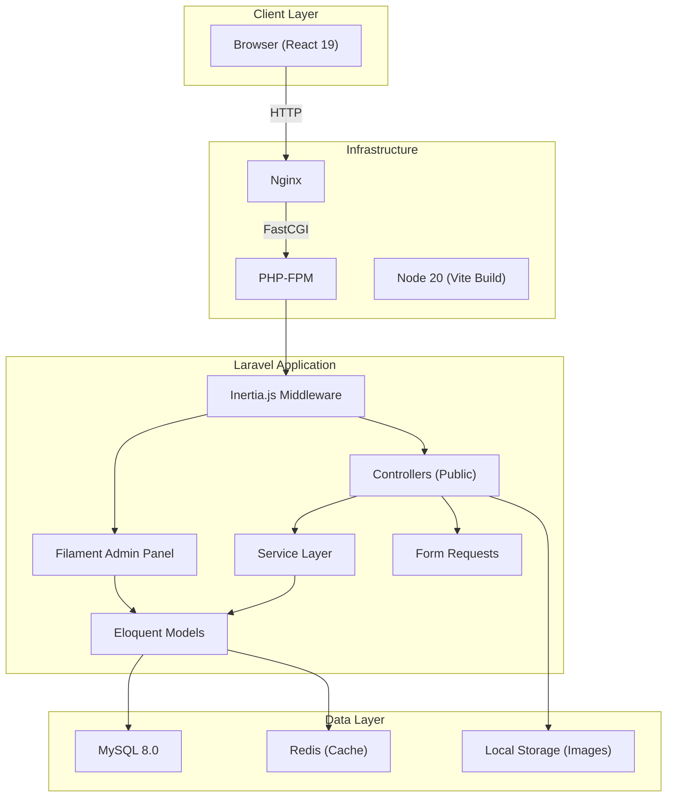
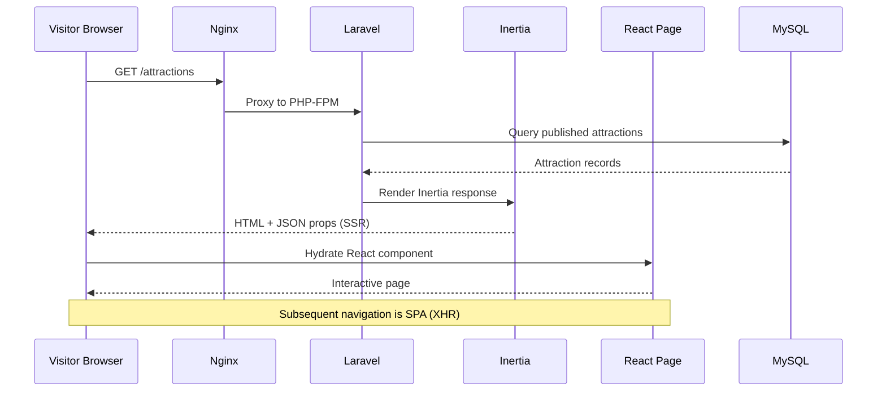

# Architecture Document — Batuan Village Tourism Website
*Produced by Winston (Architect) — Phase 3*

---

## 1. System Overview



### Request Flow



---

## 2. Tech Stack (Confirmed)

| Layer | Technology | Version | Rationale |
|-------|-----------|---------|-----------|
| Backend Framework | Laravel | 12.x | Existing skeleton, strong ecosystem |
| Admin Panel | Filament | 3.x | Already installed, rich CMS features |
| Frontend Bridge | Inertia.js | 2.x | Already installed, SSR-capable for SEO |
| UI Framework | React | 19.x | Already installed, modern component model |
| CSS | Tailwind CSS | 4.x | Already installed, utility-first, rapid UI |
| Database | MySQL | 8.0 | Docker service already configured |
| Cache | Redis | Latest | Docker service already configured |
| Build Tool | Vite | 7.x | Already configured |
| Containerization | Docker Compose | — | Already configured with app/web/db/redis/node |

### Additional Packages Required

| Package | Purpose | ADR |
|---------|---------|-----|
| `spatie/laravel-medialibrary` | Image uploads, conversions (WebP), responsive images | ADR-001 |
| `spatie/laravel-sitemap` | Auto-generated sitemap.xml | ADR-002 |
| `spatie/laravel-sluggable` | Auto-slug generation for models | — |

---

## 3. Component Architecture

### Directory Structure (New Files)

```
app/
├── Http/
│   ├── Controllers/
│   │   ├── HomeController.php
│   │   ├── AboutController.php
│   │   ├── AttractionController.php
│   │   ├── ArtCultureController.php
│   │   ├── ArtistController.php
│   │   ├── VisitInfoController.php
│   │   ├── GalleryController.php
│   │   ├── EventController.php
│   │   ├── ContactController.php
│   │   └── SitemapController.php
│   ├── Requests/
│   │   └── InquiryRequest.php
│   └── Middleware/
│       └── SetLocale.php
├── Models/
│   ├── Page.php
│   ├── Attraction.php
│   ├── Artist.php
│   ├── Event.php
│   ├── GalleryImage.php
│   ├── Inquiry.php
│   └── SiteSetting.php
├── Services/
│   ├── SeoService.php           # Meta tags, JSON-LD generation
│   └── SiteSettingService.php   # Cached site settings
├── Filament/
│   └── Resources/
│       ├── PageResource.php
│       ├── AttractionResource.php
│       ├── ArtistResource.php
│       ├── EventResource.php
│       ├── GalleryImageResource.php
│       ├── InquiryResource.php
│       └── SiteSettingResource.php
└── Providers/

database/
├── migrations/
│   ├── xxxx_create_pages_table.php
│   ├── xxxx_create_attractions_table.php
│   ├── xxxx_create_artists_table.php
│   ├── xxxx_create_events_table.php
│   ├── xxxx_create_gallery_images_table.php
│   ├── xxxx_create_inquiries_table.php
│   └── xxxx_create_site_settings_table.php
├── factories/
│   ├── PageFactory.php
│   ├── AttractionFactory.php
│   ├── ArtistFactory.php
│   ├── EventFactory.php
│   ├── GalleryImageFactory.php
│   └── InquiryFactory.php
└── seeders/
    ├── DatabaseSeeder.php
    ├── AttractionSeeder.php      # Pre-seed Batuan attractions
    ├── SiteSettingSeeder.php     # Default contact info
    └── PageSeeder.php           # Default about/visit content

resources/js/
├── app.jsx
├── Layouts/
│   └── MainLayout.jsx           # Navbar, footer, SEO head
├── Components/
│   ├── Navbar.jsx
│   ├── Footer.jsx
│   ├── HeroSection.jsx
│   ├── AttractionCard.jsx
│   ├── ArtistCard.jsx
│   ├── GalleryGrid.jsx
│   ├── LightboxModal.jsx
│   ├── EventCard.jsx
│   ├── ContactForm.jsx
│   ├── SeoHead.jsx              # Dynamic meta tags
│   ├── JsonLd.jsx               # Schema.org structured data
│   ├── MapEmbed.jsx
│   └── LanguageSwitcher.jsx
├── Pages/
│   ├── Home.jsx
│   ├── About.jsx
│   ├── Attractions/
│   │   ├── Index.jsx
│   │   └── Show.jsx
│   ├── ArtCulture.jsx
│   ├── Artists/
│   │   └── Show.jsx
│   ├── VisitInfo.jsx
│   ├── Gallery.jsx
│   ├── Events.jsx
│   └── Contact.jsx
└── lib/
    └── seo.js                   # SEO utility helpers
```

---

## 4. Data Model (ERD)

```mermaid
erDiagram
    Page {
        bigint id PK
        string title
        string slug UK
        longtext body
        string meta_title
        string meta_description
        string og_image
        string featured_image
        enum language "en|id"
        enum status "draft|published"
        int sort_order
        timestamps created_at
        timestamps updated_at
    }

    Attraction {
        bigint id PK
        string name
        string slug UK
        longtext description
        string short_description
        enum category "temple|gallery|landmark|performance|nature"
        decimal latitude
        decimal longitude
        string opening_hours
        string entrance_fee
        text visitor_tips
        string meta_title
        string meta_description
        boolean is_featured
        enum status "draft|published"
        timestamps created_at
        timestamps updated_at
    }

    Artist {
        bigint id PK
        string name
        string slug UK
        text bio
        string specialization
        string gallery_name
        string profile_photo
        json contact_info
        boolean is_featured
        enum status "draft|published"
        timestamps created_at
        timestamps updated_at
    }

    Event {
        bigint id PK
        string title
        string slug UK
        text description
        date event_date
        date end_date
        string location
        boolean is_recurring
        string recurrence_note
        string featured_image
        enum status "draft|published"
        timestamps created_at
        timestamps updated_at
    }

    GalleryImage {
        bigint id PK
        string title
        string image
        enum category "temple|art|culture|nature|village_life|event"
        text caption
        string alt_text
        int sort_order
        boolean is_published
        timestamps created_at
        timestamps updated_at
    }

    Inquiry {
        bigint id PK
        string name
        string email
        string subject
        text message
        date preferred_date
        enum status "new|read|responded"
        datetime responded_at
        timestamps created_at
        timestamps updated_at
    }

    SiteSetting {
        bigint id PK
        string key UK
        text value
        string group
        timestamps created_at
        timestamps updated_at
    }
```



### Index Strategy

| Table | Index | Purpose |
|-------|-------|---------|
| pages | `slug`, `language, status` | URL routing, listing queries |
| attractions | `slug`, `category, status`, `is_featured, status` | URL routing, filtering, homepage |
| artists | `slug`, `is_featured, status` | URL routing, featured listing |
| events | `event_date, status` | Upcoming events query |
| gallery_images | `category, is_published`, `sort_order` | Category filtering, ordering |
| inquiries | `status`, `created_at` | Admin dashboard, filtering |
| site_settings | `key` (unique) | Key lookup |

---

## 5. Security Architecture

### Authentication
- **Public site**: No authentication required (public-facing tourism site)
- **Admin panel**: Laravel session-based auth via Filament
- **User model**: Implements `FilamentUser` interface with `canAccessPanel()` method

### Input Validation
- All form submissions validated via dedicated `FormRequest` classes
- `InquiryRequest`: validates name, email format, subject, message, optional date

### Rate Limiting
- Inquiry form: 5 requests per IP per hour (`ThrottleRequests` middleware)
- API endpoints (if added): 60 requests per minute

### CSRF Protection
- Inertia.js uses Laravel's built-in CSRF token — no custom handling needed

### Data Protection
- No user PII stored beyond inquiry submissions
- Inquiry emails validated but not verified
- Admin passwords hashed via `bcrypt`

---

## 6. SEO Architecture

### Server-Side Rendering
- Inertia.js renders initial HTML server-side (SSR mode via Node)
- Full HTML delivered to crawlers on first request
- SPA navigation for subsequent page loads

### Structured Data Strategy

| Page | Schema.org Type | Key Properties |
|------|----------------|----------------|
| Homepage | `LocalBusiness` | name, address, telephone, openingHours, image |
| Attraction Detail | `TouristAttraction` | name, description, geo, image, openingHours |
| Art & Culture | `ArtGallery` | name, description, image |
| Artist Detail | `Person` | name, description, image, jobTitle |
| Event | `Event` | name, startDate, location, description |

### SeoService Design
```php
class SeoService
{
    public function meta(string $title, string $desc, ?string $image): array;
    public function localBusiness(): array;      // JSON-LD
    public function touristAttraction(Attraction $a): array;
    public function artGallery(): array;
    public function person(Artist $a): array;
    public function event(Event $e): array;
}
```

### Sitemap
- Auto-generated via `spatie/laravel-sitemap`
- Includes: all published pages, attractions, artists, events
- Regenerated on content publish (Eloquent observer or scheduled task)

---

## 7. Routing Design

```php
// Public routes (web.php)
Route::get('/', HomeController::class);
Route::get('/about', AboutController::class);
Route::get('/attractions', [AttractionController::class, 'index']);
Route::get('/attractions/{slug}', [AttractionController::class, 'show']);
Route::get('/art-culture', ArtCultureController::class);
Route::get('/artists/{slug}', [ArtistController::class, 'show']);
Route::get('/visit', VisitInfoController::class);
Route::get('/gallery', GalleryController::class);
Route::get('/events', EventController::class);
Route::get('/contact', [ContactController::class, 'show']);
Route::post('/contact', [ContactController::class, 'store'])
    ->middleware('throttle:5,60');
Route::get('/sitemap.xml', SitemapController::class);
```

---

## 8. Infrastructure

### Docker Compose Services (Existing)

| Service | Role | Port |
|---------|------|------|
| app | PHP-FPM (Laravel) | — |
| web | Nginx | 8000 |
| db | MySQL 8.0 | 3306 |
| redis | Redis | 6379 |
| node | Vite dev server | 5173 |

### Deployment Considerations
- **Image storage**: Local `storage/app/public` with symlink to `public/storage`
- **Cache**: Redis for config, route, view, and query caching
- **Queue**: Redis-backed for future email notifications (out of MVP scope)
- **SSR**: Optional Node.js server for Inertia SSR (recommended for production)

---

*Handoff ready → Phase 4: Design (Sally, UX)*
